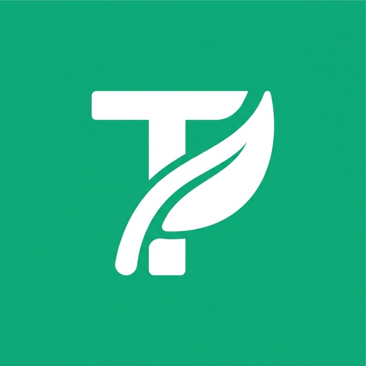

<div align="center">
  
  
  # 🛍️ ThriftIn
  
  **Your Modern Preloved & Thrift Marketplace**
  
  [](https://flutter.dev)
  [](https://dart.dev/)
  [](https://supabase.com/)
  [](https://firebase.google.com/)
</div>

<br>

ThriftIn adalah aplikasi mobile marketplace modern yang dirancang khusus untuk transaksi jual beli barang *thrift* dan *preloved*. Didesain dengan estetika yang bersih dan pengalaman pengguna yang mulus, ThriftIn memungkinkan pengguna untuk berperan sebagai **Pembeli** sekaligus **Penjual** dalam satu akun terpusat.

---

## ✨ Fitur Unggulan

- 🔄 **Peran Ganda**: Satu akun untuk menjelajah barang preloved (Pembeli) dan mengelola toko thrift Anda sendiri (Penjual).
- 🔨 **Live Bidding (Lelang)**: Fitur lelang *real-time* dengan batas waktu (*timer*) untuk penawaran harga tertinggi.
- 💬 **Real-time Chat**: Komunikasi langsung antara pembeli dan penjual berbasis produk dengan indikator pesan belum terbaca (*unread count*).
- 🔔 **Push Notifications**: Pemberitahuan sistem terintegrasi menggunakan **Firebase Cloud Messaging (FCM)** untuk order dan chat baru.
- 💳 **Checkout & Payment**: Simulasi sistem *checkout* dengan integrasi **Duitku Sandbox** via *Supabase Edge Functions*.
- 🔐 **Autentikasi Aman**: Login, registrasi, dan reset password menggunakan Email OTP via **Resend**.
- 📲 **In-App Updates**: Dukungan pembaruan otomatis langsung dari dalam aplikasi.
- 🎨 **Modern UI/UX**: Navigasi kustom *Bottom Tab Bar* yang responsif, bersih, dengan skema warna yang memanjakan mata.

---

## 🛠️ Tech Stack & Arsitektur

<table align="center">
  <tr>
    <td align="center" width="96">
      
      <br>Flutter
    </td>
    <td align="center" width="96">
      
      <br>Supabase
    </td>
    <td align="center" width="96">
      
      <br>PostgreSQL
    </td>
    <td align="center" width="96">
      
      <br>FCM
    </td>
  </tr>
</table>

- **Frontend**: Flutter & Dart
- **Backend (BaaS)**: Supabase (PostgreSQL, Storage, Edge Functions)
- **Notifikasi**: Firebase Cloud Messaging (FCM)
- **Payment Gateway**: Duitku (Sandbox Mode)
- **Email Service**: Resend (OTP Delivery)

---

## 📁 Struktur Direktori

```text
thriftin/
├── 📱 lib/
│   ├── screens/       # Halaman utama aplikasi (Home, Login, Chat, Checkout, dll)
│   ├── services/      # Logika backend (Supabase, FCM, Duitku, dll)
│   ├── widgets/       # Komponen UI Reusable (Cards, Custom Nav Bar, Buttons)
│   └── theme/         # Konfigurasi warna, tipografi, dan gaya aplikasi
├── ⚙️ supabase/
│   ├── functions/     # Edge Functions (create-duitku-transaction, password-reset-otp)
│   └── migrations/    # Skema migrasi database SQL tambahan
├── 📄 docs/           # PRD (Product Requirements Document) & presentasi
└── 🗄️ supabase_schema.sql # Skema database PostgreSQL utama
```

---

## 🚀 Panduan Menjalankan Proyek

Pastikan Anda telah menginstal **Flutter SDK** versi terbaru.

**1. Kloning Repositori & Install Dependensi**
```bash
git clone https://github.com/Kaa278/thriftin.git
cd thriftin
flutter pub get
```

**2. Setup Environment / Konfigurasi Supabase**
Aplikasi menggunakan konfigurasi *default* di `lib/services/supabase_config.dart`. Untuk menggunakan *project* Supabase Anda sendiri, jalankan dengan argumen ini:
```bash
flutter run \
  --dart-define=SUPABASE_URL=YOUR_SUPABASE_URL \
  --dart-define=SUPABASE_ANON_KEY=YOUR_SUPABASE_ANON_KEY
```

**3. Setup Database (Jika pakai instance Supabase sendiri)**
Jalankan file SQL editor di dasbor Supabase Anda sesuai urutan:
1. `supabase_schema.sql` (Skema utama)
2. `supabase/migrations/20260612074545_add_password_reset_otps.sql` (Tabel OTP)

**4. Deploy Edge Functions (Opsional)**
```bash
supabase functions deploy create-duitku-transaction
supabase functions deploy password-reset-otp

# Set Secrets
supabase secrets set DUITKU_MERCHANT_CODE=...
supabase secrets set DUITKU_API_KEY=...
supabase secrets set RESEND_API_KEY=...
```

---

## 🔒 Catatan Pengembangan (MVP)
- Proyek ini sedang dalam fase pengembangan awal (MVP) yang ditujukan untuk presentasi dan demonstrasi.
- Beberapa bagian seperti *Payment Flow*, RLS (Row Level Security) Database, dan Firebase Production Keys mungkin perlu dikonfigurasi lebih ketat jika ingin di-deploy ke fase *Production*.
- Dokumentasi Produk lengkap bisa dibaca di `docs/PRD_ThriftIn_Presentation.md`.

<br>
<p align="center">
  Dibuat dengan ❤️ oleh <b>ThriftIn Team</b>.
</p>
